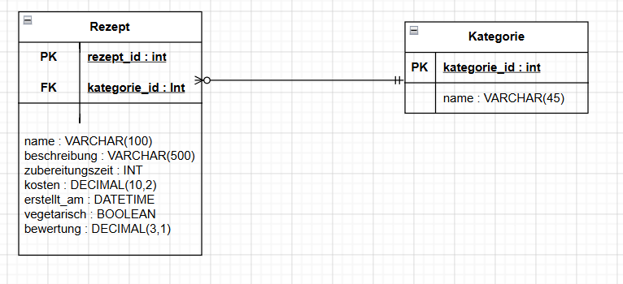
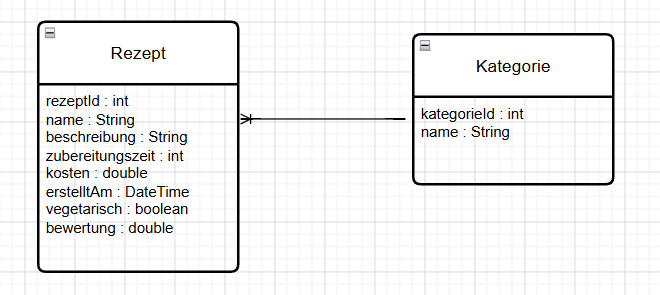
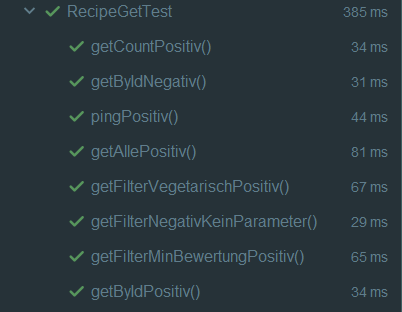
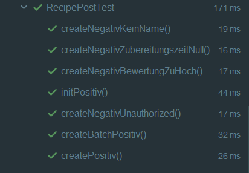
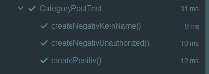
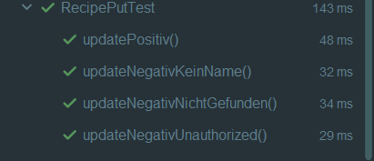
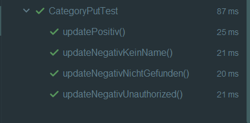
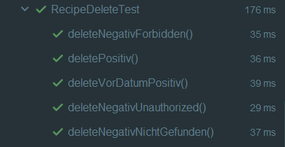
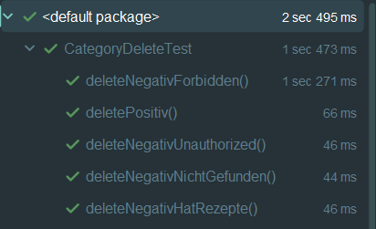

# LB295JolaMali – Rezepte REST API

## 1. Name des Projektes

**LB295JolaMali**

---

## 2. Beschreibung

Dieses Projekt ist eine Backend-Schnittstelle zur Verwaltung von Rezepten und Kategorien.  
Die API wurde mit **Jakarta EE**, **Jersey**, **Hibernate**, **MySQL**, **Maven** und **Tomcat** umgesetzt.

Die Datenquelle besteht aus zwei miteinander verbundenen Tabellen:

- `Kategorie`
- `Rezept`

Die beiden Tabellen stehen in einer **1:n-Beziehung**:

```text
Eine Kategorie kann mehrere Rezepte haben.
Ein Rezept gehört genau zu einer Kategorie.
```

---

## 3. Technologien

- Java
- Jakarta EE
- Jersey REST
- Hibernate
- MySQL
- Maven
- Tomcat
- JUnit 5
- Apache HttpClient
- OpenAPI
- GitHub

---

## 4. Projektstruktur

```text
src
 ├── main
 │   ├── java
 │   │   └── org.example.lb295
 │   │       ├── configs
 │   │       ├── daos
 │   │       ├── models
 │   │       └── services
 │   └── resources
 │       ├── META-INF
 │       │   └── persistence.xml
 │       └── recipe-api.yaml
 │
 └── test
     └── java
         └── org.example.lb295.services
```

---

## 5. Datenbankmodell

### Tabelle `Kategorie`

| Attribut | Datentyp | Beschreibung |
|---|---|---|
| KategorieId | INT | Primärschlüssel |
| Name | VARCHAR(45) | Name der Kategorie |

### Tabelle `Rezept`

| Attribut | Datentyp | Beschreibung |
|---|---|---|
| RezeptId | INT | Primärschlüssel |
| Name | VARCHAR(100) | Name des Rezepts |
| Beschreibung | VARCHAR(500) | Beschreibung des Rezepts |
| Zubereitungszeit | INT | Zubereitungszeit in Minuten |
| Vegetarisch | BOOLEAN | Gibt an, ob das Rezept vegetarisch ist |
| Bewertung | DECIMAL(3,1) | Bewertung (1.0 – 5.0) |
| Kosten | DECIMAL(10,2) | Kosten in CHF |
| ErstelltAm | DATETIME | Erstellungsdatum |
| KategorieId | INT | Fremdschlüssel auf `Kategorie` |

---

## 6. ERD



---

## 7. Klassendiagramm



---

## 8. Validierungsregeln

Neben Pflichtfeldern wurden folgende Validierungsregeln umgesetzt:

| Entität | Feld | Datentyp | Regel |
|---|---|---|---|
| Rezept | name | String | Darf nicht leer sein |
| Rezept | name | String | Maximal 100 Zeichen |
| Rezept | zubereitungszeit | Integer | Muss grösser als 0 sein |
| Rezept | bewertung | Decimal | Muss zwischen 1.0 und 5.0 liegen |
| Rezept | erstelltAm | DateTime | Darf nicht in der Zukunft liegen |
| Kategorie | name | String | Darf nicht leer sein |

Bei Validierungsfehlern gibt die API den Statuscode `400 Bad Request` mit einer Fehlermeldung zurück.

---

## 9. Berechtigungsmatrix

Die API verwendet Basic Authentication mit zwei Rollen zusätzlich zu `PermitAll`.

### Benutzer

| Benutzer | Passwort | Rolle |
|---|---|---|
| admin | 1234 | ADMIN |
| user | 1234 | USER |

### Matrix

| Endpunkt | PermitAll | USER | ADMIN |
|---|---:|---:|---:|
| GET /api/rezepte/ping | Ja | Ja | Ja |
| GET /api/rezepte | Ja | Ja | Ja |
| GET /api/rezepte/{id} | Ja | Ja | Ja |
| GET /api/rezepte/count | Ja | Ja | Ja |
| GET /api/rezepte/filter | Ja | Ja | Ja |
| POST /api/rezepte | Nein | Ja | Ja |
| POST /api/rezepte/batch | Nein | Ja | Ja |
| POST /api/rezepte/init | Nein | Ja | Ja |
| PUT /api/rezepte/{id} | Nein | Ja | Ja |
| DELETE /api/rezepte/{id} | Nein | Nein | Ja |
| DELETE /api/rezepte/vor/{datum} | Nein | Nein | Ja |
| GET /api/kategorien | Ja | Ja | Ja |
| POST /api/kategorien | Nein | Ja | Ja |
| PUT /api/kategorien/{id} | Nein | Ja | Ja |
| DELETE /api/kategorien/{id} | Nein | Nein | Ja |

---

## 10. API Endpunkte

### Rezepte

| Methode | Pfad | Beschreibung |
|---|---|---|
| GET | /api/rezepte/ping | Prüft, ob die API läuft |
| GET | /api/rezepte | Alle Rezepte lesen |
| GET | /api/rezepte/{id} | Rezept anhand ID lesen |
| GET | /api/rezepte/count | Anzahl Rezepte lesen |
| GET | /api/rezepte/filter | Rezepte filtern (vegetarisch / minBewertung) |
| POST | /api/rezepte | Neues Rezept erstellen |
| POST | /api/rezepte/batch | Mehrere Rezepte erstellen |
| POST | /api/rezepte/init | Seed-Daten erstellen |
| PUT | /api/rezepte/{id} | Rezept aktualisieren |
| DELETE | /api/rezepte/{id} | Rezept löschen |
| DELETE | /api/rezepte/vor/{datum} | Alle Rezepte vor einem Datum löschen |

### Kategorien

| Methode | Pfad | Beschreibung |
|---|---|---|
| GET | /api/kategorien | Alle Kategorien lesen |
| POST | /api/kategorien | Neue Kategorie erstellen |
| PUT | /api/kategorien/{id} | Kategorie aktualisieren |
| DELETE | /api/kategorien/{id} | Kategorie löschen |

---

## 11. Response Statuscodes

| Statuscode | Bedeutung |
|---|---|
| 200 OK | Anfrage erfolgreich |
| 201 Created | Datensatz erstellt |
| 400 Bad Request | Validierungsfehler |
| 401 Unauthorized | Authentifizierung fehlt oder ist falsch / fehlende Rolle |
| 404 Not Found | Datensatz nicht gefunden |
| 409 Conflict | Löschen nicht möglich, da verknüpfte Rezepte existieren |

---

## 12. OpenAPI Dokumentation

Die OpenAPI Dokumentation befindet sich in:

```text
src/main/resources/recipe-api.yaml
```

Die Datei kann im [Swagger Editor](https://editor.swagger.io) geöffnet werden.

---

## 13. Testing

Für die Services wurden JUnit-Integrationstests mit Apache HttpClient erstellt.  
Die Tests sind nach HTTP-Methode aufgeteilt: `RecipeGetTest`, `RecipePostTest`, `RecipePutTest`, `RecipeDeleteTest`, `CategoryGetTest`, `CategoryPostTest`, `CategoryPutTest`, `CategoryDeleteTest`.

### Getestete positive Fälle

- Ping liefert `200 OK`
- Alle Rezepte lesen liefert `200 OK`
- Rezept nach ID lesen liefert `200 OK`
- Rezept filtern (vegetarisch / minBewertung) liefert `200 OK`
- Rezeptanzahl lesen liefert `200 OK`
- Rezept erstellen liefert `201 Created`
- Batch-Rezepte erstellen liefert `201 Created`
- Rezept aktualisieren liefert `200 OK`
- Rezept löschen liefert `200 OK`
- Rezepte vor Datum löschen liefert `200 OK`
- Alle Kategorien lesen liefert `200 OK`
- Kategorie erstellen liefert `201 Created`
- Kategorie aktualisieren liefert `200 OK`
- Kategorie löschen liefert `200 OK`

### Getestete negative Fälle

- Nicht vorhandene ID liefert `404 Not Found`
- Leerer Name liefert `400 Bad Request`
- Zubereitungszeit = 0 liefert `400 Bad Request`
- Bewertung ausserhalb 1.0–5.0 liefert `400 Bad Request`
- Zukünftiges Erstelldatum liefert `400 Bad Request`
- USER-Rolle bei DELETE liefert `401 Unauthorized`
- Kein Login bei geschützten Endpunkten liefert `401 Unauthorized`
- Kategorie mit verknüpften Rezepten löschen liefert `409 Conflict`

### Screenshot Testausführung










---

## 14. SQL-Skript

Das SQL-Skript enthält:

- `CREATE DATABASE`
- `CREATE TABLE Kategorie`
- `CREATE TABLE Rezept`
- Fremdschlüssel zur Sicherstellung der referentiellen Integrität
- Mindestens zwei `INSERT INTO` pro Tabelle

Das SQL-Skript befindet sich in:

```text
docs/create_tables.sql
```

---

## 15. Logging

In den Services wurde Logging mit **Log4j2** eingebaut.  
Folgende Aktionen werden protokolliert:

- GET-Anfragen (alle Endpunkte)
- POST-Anfragen
- PUT-Anfragen
- DELETE-Anfragen
- Erfolgreiche Operationen
- Fehlgeschlagene Operationen
- Validierungsfehler
- Nicht gefundene Datensätze

---

## 16. Fehlerhandling

Die API gibt bei Fehlern passende HTTP-Statuscodes und verständliche Meldungen zurück.

Beispiele:

```text
400 Bad Request  – Name cannot be empty / Rating must be between 1.0 and 5.0
404 Not Found    – Recipe not found / Category not found
409 Conflict     – Category not found or has recipes
401 Unauthorized – You cannot access this resource
```

---

## 17. Beispiel-Requests (Postman)

### Rezepte

**POST /api/rezepte** – Rezept erstellen
- Auth: Basic Auth → `user` / `1234` oder `admin` / `1234`
```json
{
  "name": "Pasta",
  "zubereitungszeit": 20,
  "vegetarisch": true,
  "bewertung": 4.5,
  "erstelltAm": "2026-01-01T10:00:00",
  "kategorie": {
    "kategorieId": 1
  }
}
```

**POST /api/rezepte/batch** – Mehrere Rezepte erstellen
- Auth: Basic Auth → `user` / `1234` oder `admin` / `1234`
```json
[
  {
    "name": "Pasta",
    "zubereitungszeit": 20,
    "vegetarisch": true,
    "bewertung": 4.5,
    "erstelltAm": "2026-01-01T10:00:00",
    "kategorie": { "kategorieId": 1 }
  },
  {
    "name": "Pizza",
    "zubereitungszeit": 30,
    "vegetarisch": false,
    "bewertung": 4.0,
    "erstelltAm": "2026-01-01T10:00:00",
    "kategorie": { "kategorieId": 1 }
  }
]
```

**POST /api/rezepte/init** – Seed-Daten erstellen
- Auth: Basic Auth → `user` / `1234` oder `admin` / `1234`
- Kein Body benötigt

**PUT /api/rezepte/{id}** – Rezept aktualisieren
- Auth: Basic Auth → `user` / `1234` oder `admin` / `1234`
```json
{
  "name": "Pasta Updated",
  "zubereitungszeit": 25,
  "vegetarisch": true,
  "bewertung": 3.5,
  "erstelltAm": "2026-01-01T10:00:00",
  "kategorie": {
    "kategorieId": 1
  }
}
```

**GET /api/rezepte/filter** – Rezepte filtern
- Kein Body, Query-Parameter in der URL:
```
/api/rezepte/filter?vegetarisch=true
/api/rezepte/filter?minBewertung=3.5
```

**DELETE /api/rezepte/vor/{datum}** – Rezepte vor Datum löschen
- Auth: Basic Auth → `admin` / `1234`
- Kein Body, Datum in der URL:
```
/api/rezepte/vor/2026-01-01T10:00:00
```

### Kategorien

**POST /api/kategorien** – Kategorie erstellen
- Auth: Basic Auth → `user` / `1234` oder `admin` / `1234`
```json
{
  "name": "Italienisch"
}
```

**PUT /api/kategorien/{id}** – Kategorie aktualisieren
- Auth: Basic Auth → `user` / `1234` oder `admin` / `1234`
```json
{
  "name": "Asiatisch"
}
```

---

## 18. Zusammenfassung

In diesem Projekt habe ich eine REST API für die Verwaltung von Rezepten und Kategorien entwickelt. Die Umsetzung erfolgte mit Jakarta EE, Jersey, Hibernate und MySQL auf einem externen Tomcat-Server.

Am Anfang war die Projektstruktur nicht ganz einfach. Die Pakete mussten mehrmals umstrukturiert werden, weil die Leistungsbeurteilung spezifische Anforderungen hatte, zum Beispiel dass die Resource-Klassen im Package `services` sein müssen und eine separate DAO-Schicht vorhanden sein soll. Das war etwas verwirrend am Anfang, weil ich zuerst alles anders aufgebaut hatte und es dann komplett umstrukturieren musste. Dazu kam noch ein Bug mit `mappedBy="kategorie"` der eigentlich `mappedBy="category"` hätte sein sollen, was eine Weile gedauert hat bis ich es gefunden habe, weil der Fehler nicht sofort offensichtlich war.

Auch mit der Authentifizierung gab es eine Schwierigkeit. Ich hatte erwartet dass bei einer falschen Rolle `403 Forbidden` zurückkommt, was eigentlich auch logisch gewesen wäre. Aber der Filter gibt in beiden Fällen, also sowohl bei fehlendem Login als auch bei falscher Rolle, `401 Unauthorized` zurück. Das hat dazu geführt dass mehrere Testfälle angepasst werden mussten. Generell war das Schreiben der Tests aufwändiger als erwartet, weil ich für jeden Test im `@BeforeEach` zuerst Testdaten erstellen musste damit die Tests unabhängig voneinander laufen.

Was gut geklappt hat war die Aufteilung der Tests nach HTTP-Methode in separate Klassen. Das hat die Übersicht deutlich verbessert und es war einfacher einzelne Testfälle zu finden und zu debuggen. Auch die Validierung mit fünf verschiedenen Regeln auf unterschiedlichen Datentypen konnte ich sauber umsetzen und mit entsprechenden Testfällen absichern.

Die OpenAPI Dokumentation war auch ein neues Thema für mich. Ich musste lernen wie man Schemas, Security-Schemes und Response-Codes korrekt definiert, was anfangs etwas Zeit gebraucht hat.

Insgesamt bin ich zufrieden mit dem Ergebnis. Die API funktioniert, alle Tests laufen durch und das Projekt ist sauber strukturiert und dokumentiert. Durch dieses Projekt habe ich viel gelernt, vor allem im Umgang mit REST APIs, Hibernate, dem Deployment auf Tomcat und dem Schreiben von Integrationstests.

---

## 19. Autor

Jola Mali
